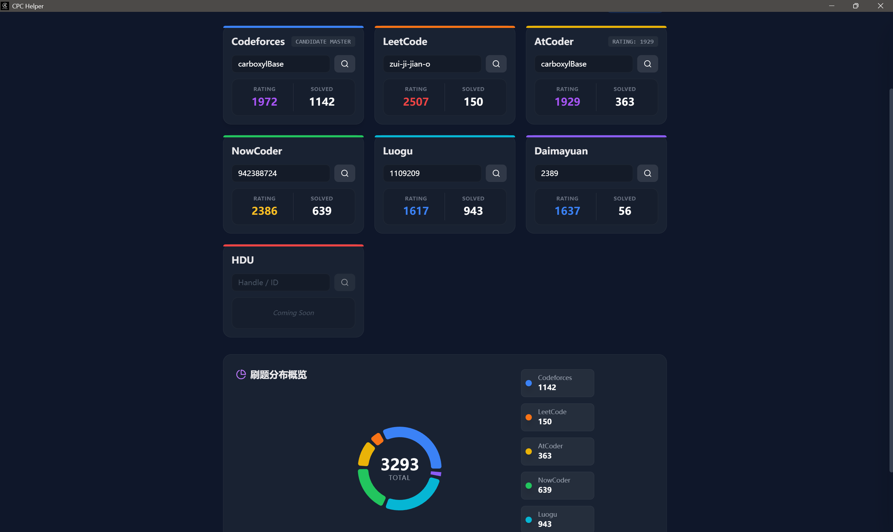

# CPC Helper (Contest App) 🚀


**CPC Helper** 是一款专为算法竞赛（ACM/ICPC, OI）选手打造的现代化跨平台桌面应用。

它基于高性能的 **Rust (Tauri v2)** 和 **React** 构建，旨在通过“聚合”与“直观”的界面，帮助选手统一管理多平台比赛日程，并可视化追踪个人刷题战绩。告别在不同 OJ 之间反复切换的烦恼，专注于解题本身。

---

## ✨ 核心特性 (Features)

### 1. 🏆 全平台战绩聚合
支持一键并发查询主流 OJ 平台的个人战绩，并生成可视化的数据仪表盘。
目前已完美支持以下 **7 大平台**：
- **Codeforces** (Rating & Solved)
- **AtCoder**
- **LeetCode** (力扣)
- **NowCoder** (牛客网)
- **Luogu** (洛谷)
- **Daimayuan** (代码源) `NEW!`
- **HDU** (杭电 OJ)

### 2. 📅 比赛日程管理
- 自动拉取各平台的近期比赛列表。
- 统一的时间线展示，不再错过任何一场 Rating 赛。

### 3. 📊 可视化仪表盘
- 采用 **光谱配色方案** (赤橙黄绿青蓝紫) 区分不同平台。
- 交互式饼图展示刷题分布，直观了解自己的训练重心。

### 4. 🚀 极致性能 & 自动更新
- **Rust 后端**：基于 Tokio 的异步高并发爬虫，秒级完成所有平台数据聚合。
- **轻量级**：安装包体积小，内存占用低。
- **OTA 自动更新**：基于 GitHub Releases 的增量更新机制，软件启动即自动检测新版本，无感升级。

---
## 📸 预览 (Screenshots)

| 战绩仪表盘 (Dashboard) | 比赛日程 (Calendar) |
| :---: | :---: |
|  |  |
---

## 📥 下载安装 (Installation)

本项目支持 **Windows**, **macOS**, **Linux** 三大平台。

请前往 [**Releases 页面**](https://github.com/carboxylBase/CPC-Helper/releases) 下载最新版本的安装包：

- **Windows**: 下载 `.msi` 或 `.exe` 文件。
- **macOS**: 下载 `.dmg` 文件。
- **Linux**: 下载 `.AppImage` 或 `.deb` 文件。

> **注意**：从 v1.1.1 版本开始，软件支持自动更新。您只需手动安装一次，后续更新将自动推送。

---

## 🛠️ 本地开发 (Development)

如果你对本项目感兴趣，欢迎 clone 代码进行二次开发。

### 前置要求
- [Node.js](https://nodejs.org/) (建议 LTS 版本)
- [Rust](https://www.rust-lang.org/) (建议 Stable 版本)
- 包管理器 (npm / pnpm / yarn)

### 启动步骤

1. **克隆仓库**
```bash
   git clone [https://github.com/carboxylBase/CPC-Helper.git](https://github.com/carboxylBase/CPC-Helper.git)
   cd CPC-Helper
```

2. **安装依赖**
```bash
npm install
```


3. **开发模式运行** (同时启动 React 前端和 Rust 后端)
```bash
npm run tauri dev
```


4. **打包构建**
```bash
npm run tauri build
```


---

## 🏗️ 技术栈 (Tech Stack)

* **Core**: [Tauri v2](https://v2.tauri.app/) (Rust) - 提供系统级 API 与原生性能。
* **Frontend**: React 18 + TypeScript + Vite.
* **Styling**: Tailwind CSS + Framer Motion.
* **Visualization**: Recharts.
* **Network**: Reqwest + Tokio (Rust 异步运行时).
* **Parsing**: Regex (高性能 HTML 正则解析).
* **CI/CD**: GitHub Actions (自动构建与发布).

---

## 🤝 贡献 (Contributing)

欢迎提交 Issue 反馈 Bug，或提交 Pull Request 增加新功能

1. Fork 本仓库
2. 新建 Feat_xxx 分支
3. 提交代码
4. 新建 Pull Request

## 📄 许可证 (License)

本项目基于 [MIT License](https://gs.jurieo.com/gemini/official/search?q=LICENSE) 开源。
