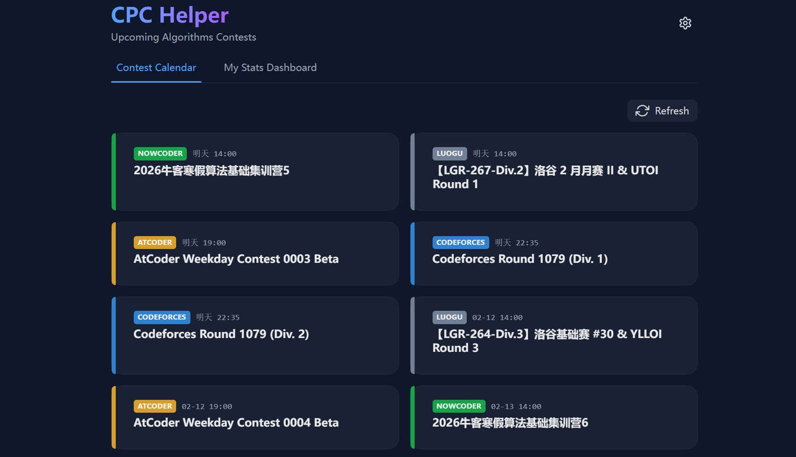

# 🏆 CPC Helper (Algorithm Contest Assistant)

[](https://www.rust-lang.org/)
[](https://tauri.app/)
[](https://reactjs.org/)
[](./LICENSE)

**CPC Helper** 是一款基于 **Tauri v2** 和 **React** 构建的现代化、跨平台算法竞赛辅助工具。旨在帮助 CP (Competitive Programming) 选手高效管理比赛日程，并一站式查询多平台个人战绩。


 ## ✨ 核心功能

* **📅 全能比赛日历**：实时聚合 **Codeforces**, **AtCoder**, **LeetCode**, **NowCoder (牛客)**, **Luogu (洛谷)** 等主流平台的近期比赛，不再错过任何一场掉分（上分）机会。
* **📊 个人战绩仪表盘**：
    * 支持多平台 Rating、排名及刷题数查询。
    * **动态可视化**：基于 Recharts 的交互式甜甜圈图，展示你的刷题分布。
    * **平滑体验**：精心调教的 UI 动画与物理惯性交互。
* **🚀 极致性能 & 体验**：
    * **Rust 驱动**：利用 Tokio 实现高并发爬虫，毫秒级响应。
    * **智能反爬**：内置针对洛谷等平台的 WAF 绕过与重试机制。
    * **状态保持**：优化的 Keep-Alive 策略，切换页面数据不丢失。

## 🛠️ 技术栈

* **Core**: Rust, Tauri v2
* **Frontend**: React, TypeScript, Tailwind CSS, Framer Motion
* **Visualization**: Recharts
* **Network**: Reqwest, Tokio

## 📦 安装与运行

1.  克隆仓库：
    ```bash
    git clone [https://github.com/your-username/cpc-helper.git](https://github.com/your-username/cpc-helper.git)
    cd cpc-helper
    ```

2.  安装依赖：
    ```bash
    npm install
    # 或者
    pnpm install
    ```

3.  开发模式启动：
    ```bash
    npm run tauri dev
    ```

## 🤝 贡献

欢迎提交 Issue 或 Pull Request！无论是增加新平台支持，还是优化 UI 细节，我们都非常期待你的参与。

---